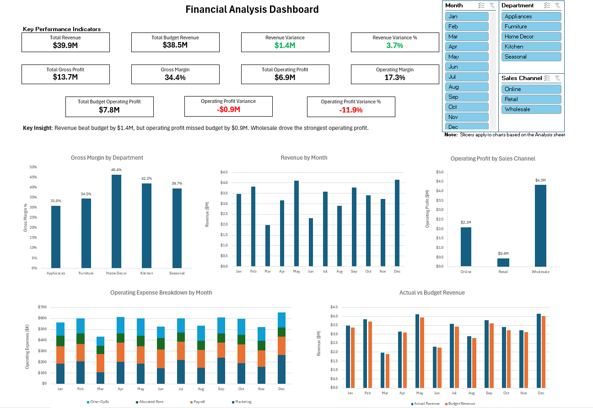
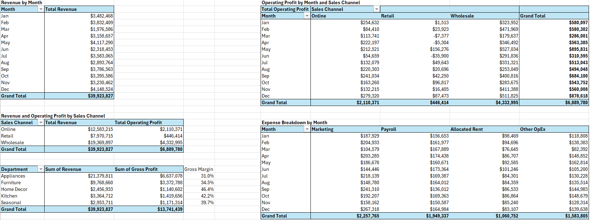
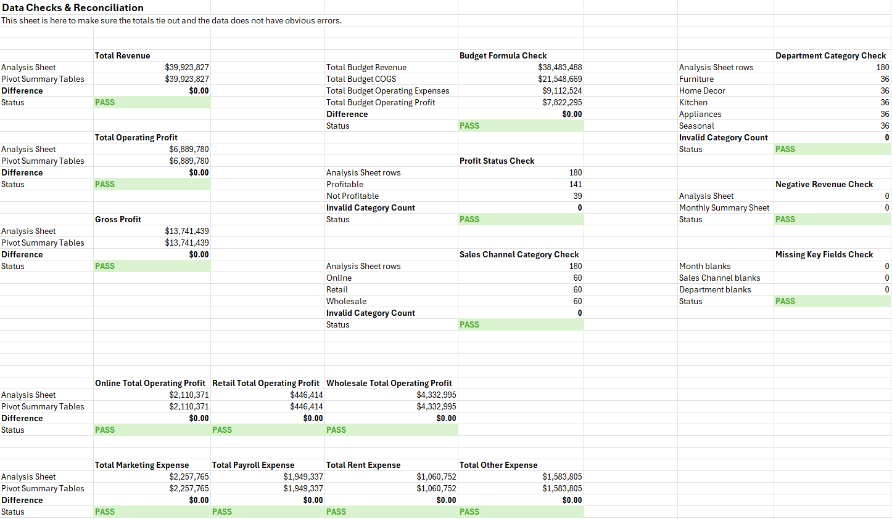

# Financial Analysis Dashboard Project

## Project Overview

This project is an Excel-based financial analysis dashboard built to review revenue, expenses, profitability, and budget performance for a simulated business.

The workbook uses synthetic financial data organized by month, sales channel, and department. The goal of the project is to show how Excel can be used to turn financial data into useful business insights through formulas, PivotTables, charts, slicers, KPI cards, and reconciliation checks.

This project is meant to demonstrate skills relevant to financial analyst, FP&A analyst, business analyst, and operations analyst roles.

## Dashboard Preview

## Main Business Questions

This project looks at questions such as:

- How much revenue did the business generate?
- Did actual revenue perform above or below budget?
- Which sales channel produced the most operating profit?
- Which departments had the strongest gross margins?
- How did operating expenses change by month?
- Do the workbook totals tie out across the analysis, PivotTables, and dashboard?

## Key Findings

- Total revenue was approximately **$39.9M**.
- Total budget revenue was approximately **$38.5M**.
- Revenue beat budget by approximately **$1.4M**, or **3.7%**.
- Total gross profit was approximately **$13.7M**.
- Gross margin was approximately **34.4%**.
- Total operating profit was approximately **$6.9M**.
- Operating margin was approximately **17.3%**.
- Operating profit missed budget by approximately **$0.9M**, or **11.9%**.
- Wholesale generated the strongest operating profit.
- Home Decor had the highest gross margin.

## Tools Used

- Microsoft Excel
- Excel Tables
- Formulas
- PivotTables
- PivotCharts
- Slicers
- Conditional Formatting
- Dashboard Design
- Data Checks and Reconciliation

## Workbook Structure

The workbook includes the following sheets:

### Raw Data

Contains the synthetic financial data used for the project. The data is organized by month, sales channel, and department.

### Budget

Contains monthly budget values for revenue, cost of goods sold, operating expenses, and operating profit.

### Analysis

Adds calculated financial metrics such as gross profit, total operating expenses, operating profit, gross margin, operating margin, revenue per unit, COGS per unit, expense ratio, and profit status.

### Monthly Summary

Compares actual revenue and operating profit against budget by month.

### Pivot Summary

Contains PivotTables used to summarize revenue, operating profit, gross margin, and expense trends.

### Dashboard

Shows the main KPI cards, charts, slicers, and key insight for the project.

### Reconciliation

Checks that the main totals tie out across the workbook and that the data does not have obvious errors.

## Pivot Summary Preview

## Reconciliation Preview

## Main Metrics Used

Some of the main metrics calculated in the project include:

- Total Revenue
- Budget Revenue
- Revenue Variance
- Revenue Variance %
- Gross Profit
- Gross Margin
- Total Operating Expenses
- Operating Profit
- Operating Margin
- Operating Profit Variance
- Operating Profit Variance %
- Revenue per Unit
- COGS per Unit
- Expense Ratio
- Profit Status

## Data Note

This project uses synthetic data created for portfolio and learning purposes. The data does not represent real company financial information.

## Skills Demonstrated

This project demonstrates:

- Financial analysis in Excel
- Budget vs actual variance analysis
- Revenue and profitability analysis
- Expense breakdown analysis
- Gross margin and operating margin analysis
- PivotTable reporting
- Dashboard creation
- KPI card design
- Chart formatting
- Slicer usage
- Reconciliation and data checks
- Communicating business insights from financial data

## Files Included

- `Financial Analysis Dashboard Project.xlsx`
- `financial_analysis_dashboard.png`
- `financial_analysis_pivot_tables.png`
- `financial_analysis_reconciliation.png`
